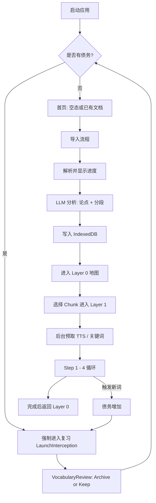
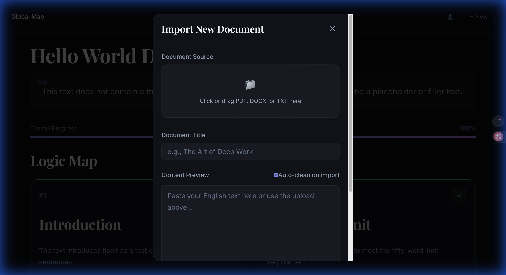
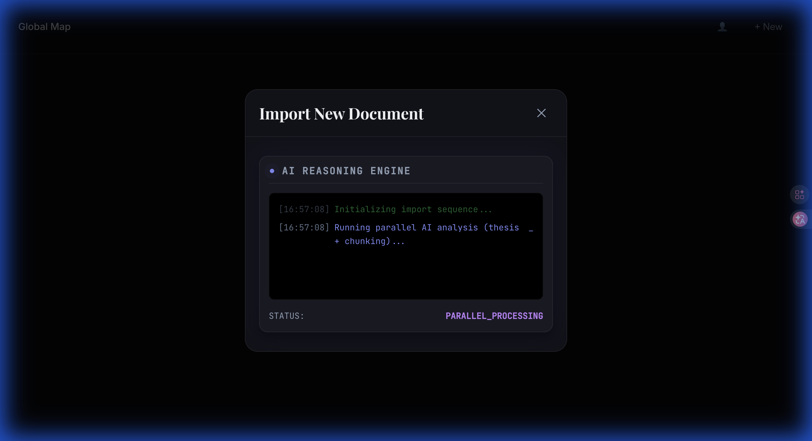
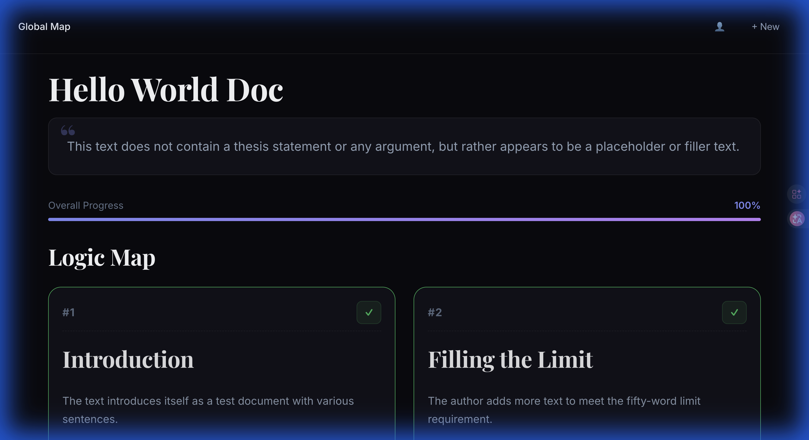
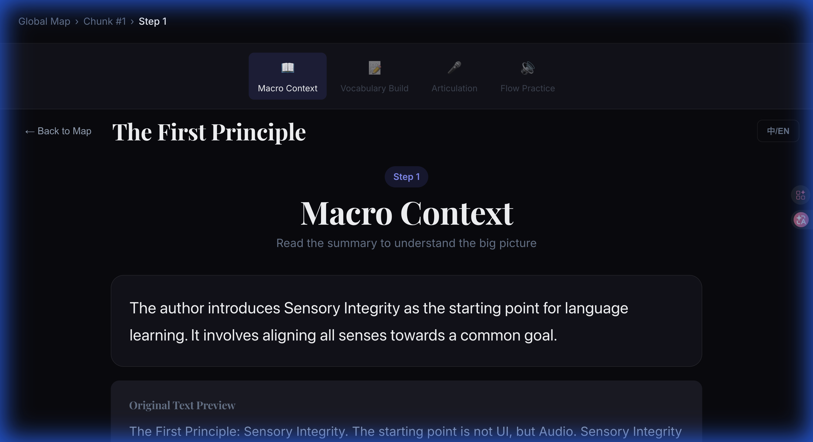
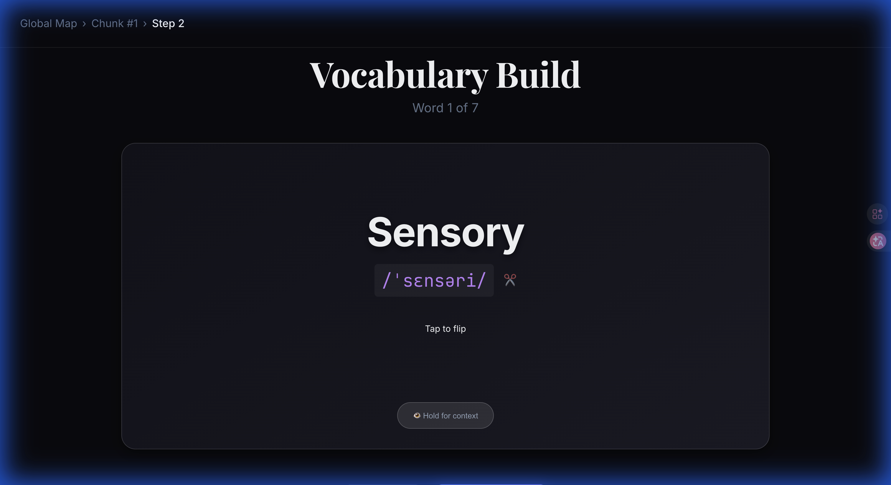
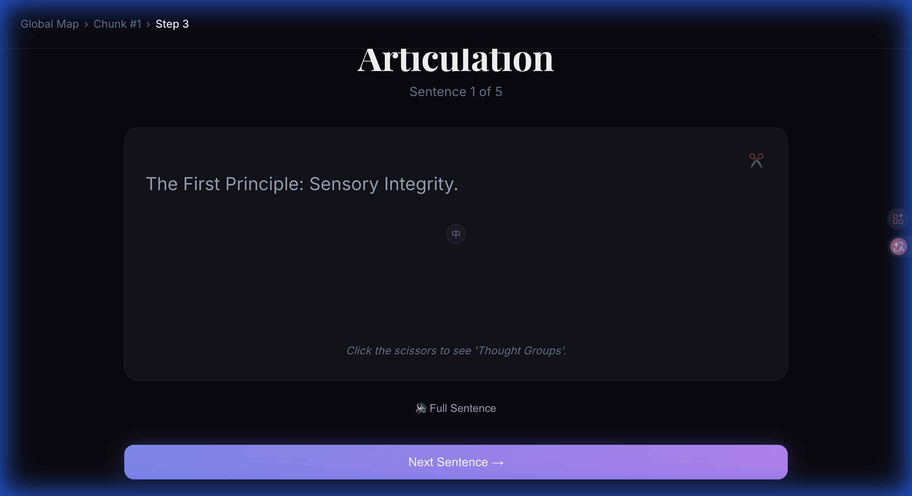
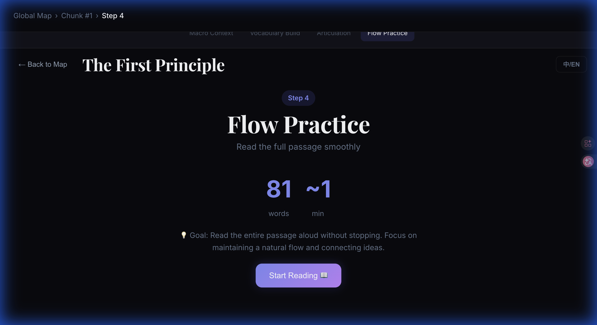

# Deep Internalizer: 项目演进与逻辑合成 (Evolution & Logic Synthesis)

> "知道‘为什么’而活的人，便能生存于任何‘如何’之中。" —— 尼采
> 本文档记录了将一个“学习工具”转化为语言习得“认知义肢”的代谢过程。

---

## 0. 第一性原理：感官完整性 (The First Principle: Sensory Integrity)
项目的起点并非 UI，而是 **Audio (音频)**。如果声音失真，思维模型便会存在缺陷。
- **关键转折 (The Pivot)**: 在 Qwen3-TTS 输出静电杂音时进行了重新对齐。
- **逻辑 (The Logic)**: 音频不仅是“输出”，更是通往语音记忆 (Phonological Memory) 的桥梁。

## 1. 第一阶段：构建骨架 (Phase I: Foundations)
建立处理高频语言数据的技术架构。
- **架构清理**: 系统性地解决了 P0-P2 级的质量问题（ESLint、React Hook 反模式）。
- **去冗余 (DRY)**: 将重复逻辑整合至共享组件与工具类中。
- **双语核心**: 全局集成 `isBilingual` 状态，确保翻译在各个层级间的一致性。

## 2. 第二阶段：代谢优化 (Phase II: Metabolic Optimization)
从“可用”转向“无缝”。
- **TTS 缓存策略**: 
    - **单词 (Words)**: 存储于 IndexedDB（高复用率）。
    - **句子 (Sentences)**: 不缓存（独特语境）。
    - **音节 (Syllables)**: 缓存常用后缀（如 -tion, -ing）以降低延迟。
- **思维 UI (Thinking UI)**: 将 7 秒的“死等”转化为互动的“思考进程”，实时暴露 AI 的推理步骤。
- **请求合并**: 将关键词提取与语境生成合并为单个 LLM 流，极大降低了往返时延 (RTT)。

## 3. 第三阶段：美学即功能 (Phase III: Magazine UX)
设计并非装饰，而是信息的等级制度。
- **杂志化布局 (Magazine Layout)**: 从通用的 Web 表单转向高对比度、杂志风格的视觉架构。
- **排版缩放**: 提升了基础字号并更新了全局 CSS 变量，优先平衡易读性与视觉密度。
- **视觉反馈**: 实现音节级慢速播放 (0.7x)，并伴随实时高亮，同步视觉与听觉感知。

## 4. 当前状态：发布加固 (Current State)
- **内部版本**: 实现了自动版本化与 GitHub 部署流水线。
- **文档体系**: 为技术实现与缓存策略建立了详尽的演示文档。
- **健壮性**: 修复了 `ReferenceError` 崩溃及边缘状态管理问题。

---

## 5. 核心功能模块概览 (Core Functional Modules)

此部分定义了系统的功能骨架及其对应的技术实现。

### 5.1 导入与解析模块 (Ingestion & Parsing)
- **功能**: 支持 `.pdf` / `.docx` / `.txt` 导入，解析文本，自动清洗断行，展示解析进度与耗时。
- **关键文件**: [ImportModal.jsx](file:///Users/a2030/01-Project/English%20Learning/deep-internalizer/src/components/common/ImportModal.jsx), `fileParser.js`
- **关键优化**: 分批 PDF 解析、进度显示、自动清洗 + 可撤销、解析耗时统计。

### 5.2 AI 语义处理模块 (Cognitive Processing)
- **功能**: 生成核心论点 (Thesis)、语义切分 (Chunks)、关键词提取、思维意群划分 (Thought Groups)、句子翻译。
- **关键文件**: [chunkingService.js](file:///Users/a2030/01-Project/English%20Learning/deep-internalizer/src/services/chunkingService.js)
- **优化与缓存**:
  - 文档分析缓存 (core thesis + chunks)
  - 句子意群缓存 (thought groups)
  - 关键词、翻译缓存 (IndexedDB)

### 5.3 Layer 0: 全局蓝图 (Global Strategic Map)
- **功能**: 展示文档核心论点、语义块概览、完成进度。
- **关键文件**: [GlobalBlueprint.jsx](file:///Users/a2030/01-Project/English%20Learning/deep-internalizer/src/components/Layer0/GlobalBlueprint.jsx)
- **输出**: 点击某个 Chunk 进入 Layer 1。

### 5.4 Layer 1: 深度内化循环 (Tactical Immersion)
- **功能**: 四步学习流程，强制顺序推进。
- **关键文件**: [SegmentLoop.jsx](file:///Users/a2030/01-Project/English%20Learning/deep-internalizer/src/components/Layer1/SegmentLoop.jsx)
  - **Step 1：宏观语境**（summary + 原文预览）
  - **Step 2：词汇构建**（关键词卡片 + 音节拆分 + 原文回看）
  - **Step 3：意群训练**（句子分组 + TTS 发音 + 翻译）
  - **Step 4：流畅阅读**（计时 + WPM 计算）

### 5.5 TTS 音频模块 (Audio Engine)
- **功能**: 词汇级缓存、音节级缓存、句子即时生成。
- **关键文件**: [ttsService.js](file:///Users/a2030/01-Project/English%20Learning/deep-internalizer/src/services/ttsService.js), `useTTS.js`
- **优化**: 缓存命中、预取队列限并发、减少重复请求。

### 5.6 债务与复习系统 (Debt & Review System)
- **功能**: 新词进入 debt，必须复习后才能继续阅读。
- **关键文件**: [VocabularyReview.jsx](file:///Users/a2030/01-Project/English%20Learning/deep-internalizer/src/components/VocabularyReview.jsx), `LaunchInterception.jsx`
- **行为**: 阻断新内容 → 进入 Review → Archive or Keep。

### 5.7 用户统计与数据管理 (User Insights)
- **功能**: 热力图统计、导出/导入备份、清空数据。
- **关键文件**: [UserProfile.jsx](file:///Users/a2030/01-Project/English%20Learning/deep-internalizer/src/components/UserProfile.jsx), `Heatmap.jsx`

---

## 6. 整体流程：从用户视角 (The User Journey)

---

## 7. 用户指南：认知内化之旅 (User Guide: The Cognitive Journey)

本节详细说明如何使用 Deep Internalizer 将碎片化的信息转化为深层的认知资产。

### 5.1 开启旅程：导入与分析 (Ingestion & AI Processing)
在首页点击 `+ New` 或直接进入导入界面。你可以粘贴纯文本，或上传 PDF/DOCX 文件。
- **AI 实时推理**: 导入后，你会看到“思维 UI”，实时展示 AI 如何对文章进行语义切片和论点合成。

*图 1: 支持多种格式的内容导入*

*图 2: 实时展示 AI 的认知处理过程*

### 5.2 全局地图：逻辑锚定 (Layer 0: Logic Mapping)
分析完成后，你将进入 **Logic Map**。这里通过“漏斗”将全文浓缩为唯一的“核心论点”，并将其拆分为多个逻辑块。
- **操作**: 点击任意一个逻辑卡片，即可进入该环节的深度内化循环。

*图 3: 基于语义的逻辑导图*

### 5.3 深度内化循环 (Layer 1: The 4-Step Loop)
每一个逻辑块都包含以下四个步骤，旨在通过多感官协同完成知识“代谢”：

#### Step 1: 宏观语境 (Macro Context)
在详细阅读前，AI 会先为你提供该片段的宏观总结。这有助于大脑建立初步的语义支架。

*图 4: 建立认知支架*

#### Step 2: 词汇构建 (Vocabulary Build)
不仅是单词，更是语境。系统会自动提取核心术语。
- **X-Ray 语境**: 长按单词卡片可直接查看该词在原文中的具体出处。

*图 5: 交互式词汇深度学习*

#### Step 3: 发音训练 (Articulation)
通过 IPA 音标和高保真 TTS，训练你的“内耳”。关注意群 (Thought Groups) 和语感。

*图 6: 听觉与视觉的同步训练*

#### Step 4: 心流练习 (Flow Practice)
最后，你将尝试以自然的节奏完整读出该片段。系统会追踪你的 WPM（每分钟词数），确保达到内化标准的流利度。

*图 7: 追求极致的认知流利度*

---

### #ActionPlan: 下一步计划
1. **[ ]** 增加“遗忘曲线”进度跟踪面板。
2. **[ ]** 优化移动端在 Step 3 的录音对比功能。
3. **[ ]** 集成更深层的双语对比视图（支持逐句对齐）。

---

### #InternalLogic: 演进背后的“为什么”
项目的演进揭示了一个从 **Complexity (复杂性)** 到 **Simplicity via Optimization (通过优化实现简洁)** 的必然过程。系统现在承担了“繁重的工作”（切词、TTS、缓存），以便用户能专注于“深层的思考”（内化）。

### 苏格拉底式提问 (Socratic Depth)
*当我们的技术手段（如音节缓存与自动化流程）不断逼近“零延迟”时：*

1. **认知处理 (Cognitive Processing)**: 语言习得的瓶颈究竟是音频的 *交付速度*，还是学习者的 *认知处理速度*？如果是后者，我们的架构应如何演进以适应差异化的步频？
2. **机械感 vs. 韵律 (Prosody)**: 如果我们完美缓存了每一个音素单元，是否会因丢失自然语流而产生“机械感”，从而破坏深层听觉习得所需的韵律？
3. **逆向思维 (Inversion)**: 这种“保姆式”的学习流程是否会削弱学习者在处理真实、杂乱信息时的*抗挫折能力 (Desirability of Difficulty)*？

---
*创建日期: 2026-02-03 | 状态: Internal v1.0.x*
